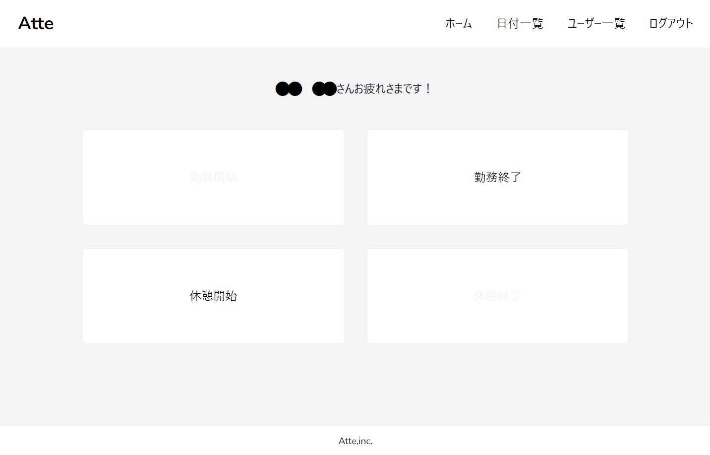
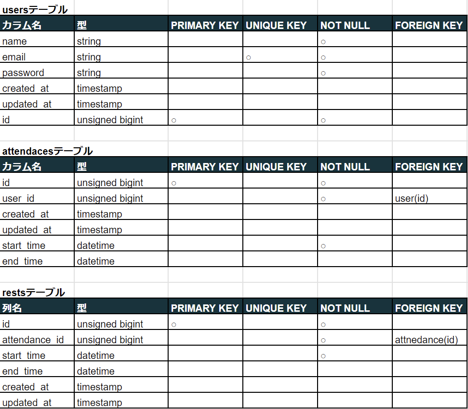
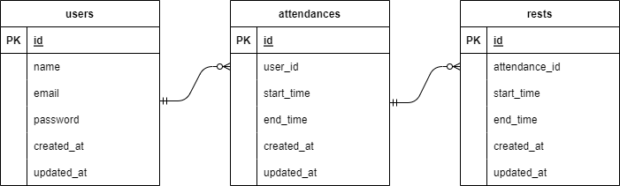

# Atte
勤怠管理アプリケーション

## 作成した目的
webアプリ開発の勉強のため

## アプリケーションURL
* 開発(ローカル)環境
  http://localhost/
* 本番(EC2)環境
  [http://ec2-18-182-45-97.ap-northeast-1.compute.amazonaws.com/](http://ec2-18-182-45-97.ap-northeast-1.compute.amazonaws.com/){:target="_blank"}

## 他のリポジトリ
* ソースコード(GitHub)
  [https://github.com/takamasa-seto/atte](https://github.com/takamasa-seto/atte)

## 機能一覧
  * 会員登録
    ログイン画面右下の"アカウント作成"から会員登録画面を表示する。登録時は登録されたメールアドレスに確認メールが送信される。
  * ログイン
    確認メールにより認証されたユーザのみがログイン可能。
  * ログアウト
    ホーム画面右上のナビゲーションからログアウトできる。
  * 勤務開始
    ホーム画面の勤務開始ボタンが押されたときの勤務開始時刻を登録する。
  * 勤務終了
    ホーム画面の勤務終了ボタンが押されたときの勤務終了時刻を登録する。
  * 休憩開始
    ホーム画面の休憩開始ボタンが押されたときの休憩開始時刻を登録する。
  * 休憩終了
    ホーム画面の休憩開始ボタンが押されたときの休憩終了時刻を登録する。
  * 日付別勤怠情報表示
    日付ごとに登録された勤怠情報（ユーザー名、勤務時間、休憩時間）を一覧表示する。ホーム画面右上のナビゲーションから表示できる。
  * ユーザー一覧表示
    全ユーザの一覧を表示する。ホーム画面右上のナビゲーションから表示できる。
  * ユーザーごとの勤怠情報表示
    ユーザごとの勤怠情報を一覧表示する。ユーザー一覧画面から選択したユーザの勤怠情報を表示できる。

## 使用技術(実行環境)
  * 開発フレームワーク
    laravel8.83.8  
    ※ ユーザ認証にはBreezeを使用
  * 仮想サーバ
    EC2 (本番環境のみ)
  * データベース
    RDS (本番環境のみ)
  * メール送信
    Amazon SES (本番環境)  
    MailHog (開発(ローカル)環境)

## テーブル設計

## ER図

# 環境構築
## 開発（ローカル）環境
ローカルでのテスト環境のセットアップ手順を示します。  
* GitHubの上記リポジトリのクローンを作業フォルダに作成。
  > git clone https://github.com/takamasa-seto/atte.git
* クローンしたatteフォルダ直下に移動。
* docker-compose-dev.ymlファイルをつかってDockerコンテナを起動。
  > docker-compose -f docker-compose-dev.yml up -d --build  
* phpコンテナにログインし、composerをインストールする。
  > docker-compose exec php bash  
  > composer install  
* srcフォルダ直下に.env.dev.exampleのコピーを作成する。
  > cp .env.dev.example .env  
* コピーした.envファイルの次の部分を編集する。
  > DB_PASSWORD=(任意のパスワード)  
* アプリケーションキーを作成する(phpコンテナにログインした状態)。
  > php artisan key:generate  
* データベースのマイグレーション(phpコンテナにログインした状態)。
  > php artisan migrate  

## 本番環境
EC2(仮想サーバ)とRDS(データベース)をつかった本番環境のセットアップ手順を示します。
* AWSのEC2インスタンス、RDS、SESのIDを作成しておく。
* GitHubの上記リポジトリのクローンをEC2のインスタンスに作成。
  > git clone https://github.com/takamasa-seto/atte.git
* クローンしたatteフォルダ直下に移動。
* docker-compose-prod.ymlファイルをつかってDockerコンテナを起動。
  > docker-compose -f docker-compose-prod.yml up -d --build  
* phpコンテナにログインし、composerをインストールする。
  > docker-compose exec php bash  
  > composer install  
* srcフォルダ直下に.env.prod.exampleのコピーを作成する。
  > cp .env.prod.example .env
* コピーした.envファイルの次の部分を編集する。
  > APP_URL=(EC2のオープンアドレス)
  > DB_HOST=(RDSのエンドポイント)  
  > DB_DATABASE=(RDSで設定したデータベース名)
  > DB_USERNAME=(RDSで設定したユーザ名)  
  > DB_PASSWORD=(RDSで設定したパスワード)  
  > MAIL_FROM_ADDRESS=(SESで設定したメールアドレス)  
  > AWS_ACCES_KEY_ID=(AWSのアクセスキー)
  > AWS_SECRET_ACCES_KEY_ID=(AWSのシークレットアクセスキー)
  > AWS_DEFAULT_REGION=(SESで設定したリージョン。日本はap-northeast-1)  

* アプリケーションキーを作成する(phpコンテナにログインした状態)。
  > php artisan key:generate  
* データベースのマイグレーション(phpコンテナにログインした状態)。
  > php artisan migrate  
